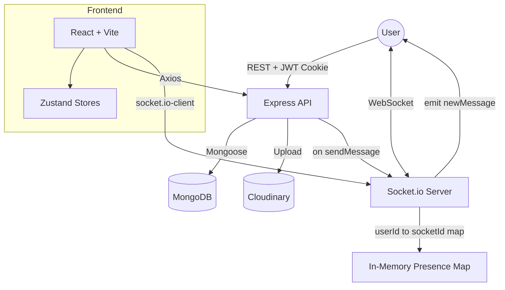

# 💬 Pulse Chat — Real-Time MERN Messaging App

A full-stack real-time chat application built to explore WebSocket communication, stateless authentication, and live presence tracking in a MERN monorepo.

[]()
[]()
[](https://pulse-chat-jet.vercel.app/)
[]()

## 🎯 Engineering Highlights

Most chat demos stop at sending a message over a socket. Pulse Chat goes a step further into the details that make real-time apps feel solid:

- **Stateless Auth:** JWTs are issued on signup/login and stored in **httpOnly cookies**, with `sameSite`/`secure` flags toggled per environment so auth survives a cross-origin Vercel → Render deployment.
- **Live Presence:** A single Socket.io connection per user is mapped in-memory (`userId → socketId`), broadcasting `getOnlineUsers` on every connect/disconnect so the UI reflects who's actually online, not who was online.
- **Targeted Delivery:** Messages are emitted only to the specific receiver's socket (not broadcast to the room), keeping the event stream private and bandwidth-efficient as the user base grows.
- **Media Messages:** Image messages are uploaded to **Cloudinary** as base64 payloads and resolved to a CDN URL before being persisted, keeping the database free of binary blobs.

---

## 🏗️ Architecture Overview

A decoupled client/server setup with a shared real-time layer sitting alongside the REST API.



---

## 🔑 Key Decisions & Trade-offs

- **In-Memory Presence Map:** Online users are tracked with a plain JS object keyed by `userId` rather than a Redis-backed store. Simple and fast for a single-instance deployment; the trade-off is that presence state doesn't survive a server restart or horizontal scaling — a natural next step would be moving this to Redis pub/sub.
- **Cookie-Based JWT over LocalStorage:** Storing the token in an httpOnly cookie trades a bit of frontend convenience (no manual header attachment) for protection against XSS token theft, at the cost of needing careful CORS/`credentials: true` configuration across origins.
- **Zustand over Redux:** State (auth, chat, theme) is split into small, independent Zustand stores instead of one global Redux store, keeping boilerplate low for a project of this size.

---

## 🛠️ Tech Stack

- **Backend:** Node.js, Express, Socket.io, Mongoose (MongoDB), JWT, bcrypt.js.
- **Frontend:** React (Vite), Zustand, React Router, Axios, Tailwind CSS + DaisyUI.
- **Media:** Cloudinary (image messages & profile pictures).
- **Deployment:** Vercel (frontend), Render (backend).

---

## 🌐 Live Demo

- **App:** [pulse-chat-jet.vercel.app](https://pulse-chat-jet.vercel.app/) — frontend deployed on **Vercel**, API deployed on **Render**.
- Cross-origin auth is handled via httpOnly cookies with `sameSite: "none"` and `secure: true` in production so the Vercel client can authenticate against the Render API.

---

## ✨ Features

- Email/password signup & login with hashed passwords (bcrypt).
- Persistent sessions via httpOnly JWT cookies.
- Real-time 1:1 messaging over WebSockets.
- Live online/offline presence indicator.
- Image messages and profile picture uploads via Cloudinary.
- Selectable UI themes (DaisyUI) with a dedicated settings page.
- Toast notifications for auth and network feedback.

---

## 🚀 Getting Started

```bash
git clone https://github.com/nitesh404/pulse-chat.git
cd pulse-chat

# install backend deps
cd backend && npm install

# install frontend deps
cd ../frontend && npm install
```

Create a `.env` file inside `backend/` with:

```env
PORT=5001
MONGODB_URI=your_mongodb_connection_string
JWT_SECRET=your_jwt_secret
CLOUDINARY_CLOUD_NAME=your_cloudinary_cloud_name
CLOUDINARY_API_KEY=your_cloudinary_api_key
CLOUDINARY_API_SECRET=your_cloudinary_api_secret
NODE_ENV=development
```

Run both apps in development:

```bash
# terminal 1 — backend
cd backend && npm run dev

# terminal 2 — frontend
cd frontend && npm run dev
```

The frontend runs on `http://localhost:5173` and the backend on `http://localhost:5001`.

---

## 🧑‍💻 About

Pulse Chat was built to get hands-on with the plumbing behind real-time apps — WebSocket lifecycle management, cookie-based auth across origins, and live presence — beyond what a typical CRUD project covers.

Built by [Nitesh](https://github.com/nitesh404)
