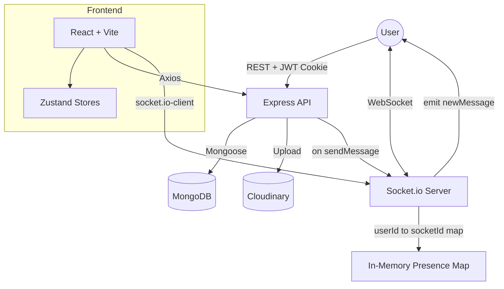

# 💬 Pulse Chat

A full-stack real-time messaging application built on the MERN stack, focused on the engineering details that make chat apps feel solid: stateless cross-origin authentication, live presence tracking, and targeted WebSocket delivery.

<p align="center">
  
  
  
  
</p>

<p align="center">
  <a href="https://pulse-chat-jet.vercel.app/"><strong>🔗 Live Demo</strong></a>
</p>

---

## Table of Contents

- [About](#about)
- [Engineering Highlights](#engineering-highlights)
- [Architecture](#architecture)
- [Key Decisions & Trade-offs](#key-decisions--trade-offs)
- [Tech Stack](#tech-stack)
- [Features](#features)
- [Getting Started](#getting-started)
  - [Prerequisites](#prerequisites)
  - [Installation](#installation)
  - [Environment Variables](#environment-variables)
  - [Running Locally](#running-locally)
- [Deployment](#deployment)
- [Contributing](#contributing)
- [License](#license)
- [Author](#author)

---

## About

Pulse Chat was built to get hands-on with the plumbing behind real-time apps — WebSocket lifecycle management, cookie-based auth across origins, and live presence — beyond what a typical CRUD project covers. It goes past "send a message over a socket" into the details that make a real-time app feel production-ready.

## Engineering Highlights

- **Stateless Auth** — JWTs are issued on signup/login and stored in `httpOnly` cookies, with `sameSite` / `secure` flags toggled per environment so auth survives a cross-origin Vercel → Render deployment.
- **Live Presence** — A single Socket.io connection per user is mapped in-memory (`userId → socketId`), broadcasting `getOnlineUsers` on every connect/disconnect so the UI reflects who's actually online, not who was online.
- **Targeted Delivery** — Messages are emitted only to the specific receiver's socket (not broadcast to a room), keeping the event stream private and bandwidth-efficient as the user base grows.
- **Media Messages** — Image messages are uploaded to **Cloudinary** as base64 payloads and resolved to a CDN URL before being persisted, keeping the database free of binary blobs.

## Architecture

A decoupled client/server setup with a shared real-time layer sitting alongside the REST API.



## Key Decisions & Trade-offs

| Decision | Why | Trade-off |
|---|---|---|
| **In-memory presence map** instead of Redis | Simple and fast for a single-instance deployment | Presence state doesn't survive a server restart or horizontal scaling — a natural next step is moving this to Redis pub/sub |
| **Cookie-based JWT** instead of localStorage | Protects against XSS token theft; no manual header attachment on the frontend | Requires careful CORS / `credentials: true` configuration across origins |
| **Zustand** instead of Redux | Keeps boilerplate low by splitting state (auth, chat, theme) into small, independent stores | Less structure/tooling than Redux for larger-scale state needs |

## Tech Stack

**Backend:** Node.js · Express · Socket.io · Mongoose (MongoDB) · JWT · bcrypt.js
**Frontend:** React (Vite) · Zustand · React Router · Axios · Tailwind CSS + DaisyUI
**Media:** Cloudinary (image messages & profile pictures)
**Deployment:** Vercel (frontend) · Render (backend)

## Features

- 🔐 Email/password signup & login with hashed passwords (bcrypt)
- 🍪 Persistent sessions via httpOnly JWT cookies
- ⚡ Real-time 1:1 messaging over WebSockets
- 🟢 Live online/offline presence indicator
- 🖼️ Image messages and profile picture uploads via Cloudinary
- 🎨 Selectable UI themes (DaisyUI) with a dedicated settings page
- 🔔 Toast notifications for auth and network feedback

## Getting Started

### Prerequisites

- [Node.js](https://nodejs.org/) (v18+ recommended)
- A [MongoDB](https://www.mongodb.com/) connection string (local or Atlas)
- A [Cloudinary](https://cloudinary.com/) account for media uploads

### Installation

```bash
git clone https://github.com/nitesh404/pulse-chat.git
cd pulse-chat

# install backend dependencies
cd backend && npm install

# install frontend dependencies
cd ../frontend && npm install
```

### Environment Variables

Create a `.env` file inside `backend/`:

```env
PORT=5001
MONGODB_URI=your_mongodb_connection_string
JWT_SECRET=your_jwt_secret
CLOUDINARY_CLOUD_NAME=your_cloudinary_cloud_name
CLOUDINARY_API_KEY=your_cloudinary_api_key
CLOUDINARY_API_SECRET=your_cloudinary_api_secret
NODE_ENV=development
```

### Running Locally

```bash
# terminal 1 — backend
cd backend && npm run dev

# terminal 2 — frontend
cd frontend && npm run dev
```

| Service | URL |
|---|---|
| Frontend | `http://localhost:5173` |
| Backend  | `http://localhost:5001` |

## Deployment

- **Frontend** is deployed on [Vercel](https://vercel.com/); **API** is deployed on [Render](https://render.com/).
- Cross-origin auth is handled via httpOnly cookies with `sameSite: "none"` and `secure: true` in production, so the Vercel-hosted client can authenticate against the Render-hosted API.
- **Live app:** [pulse-chat-jet.vercel.app](https://pulse-chat-jet.vercel.app/)

## Contributing

Contributions are welcome. If you'd like to improve Pulse Chat:

1. Fork the repository
2. Create a feature branch (`git checkout -b feature/your-feature`)
3. Commit your changes (`git commit -m 'Add some feature'`)
4. Push to the branch (`git push origin feature/your-feature`)
5. Open a Pull Request

Please open an issue first for major changes to discuss what you'd like to change.

## License

Distributed under the **ISC License**.

## Author

Built by [**Nitesh**](https://github.com/nitesh404)
